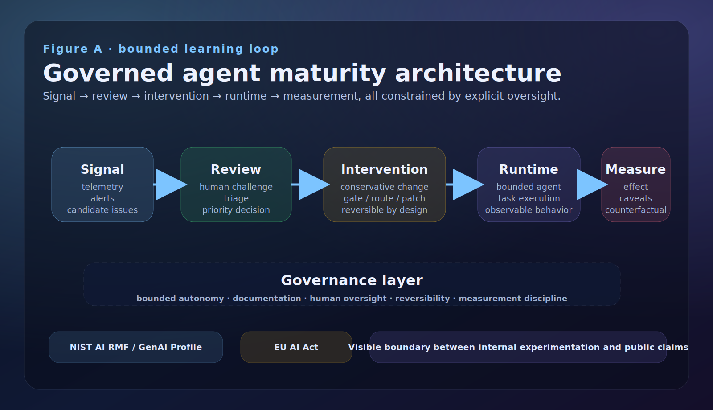
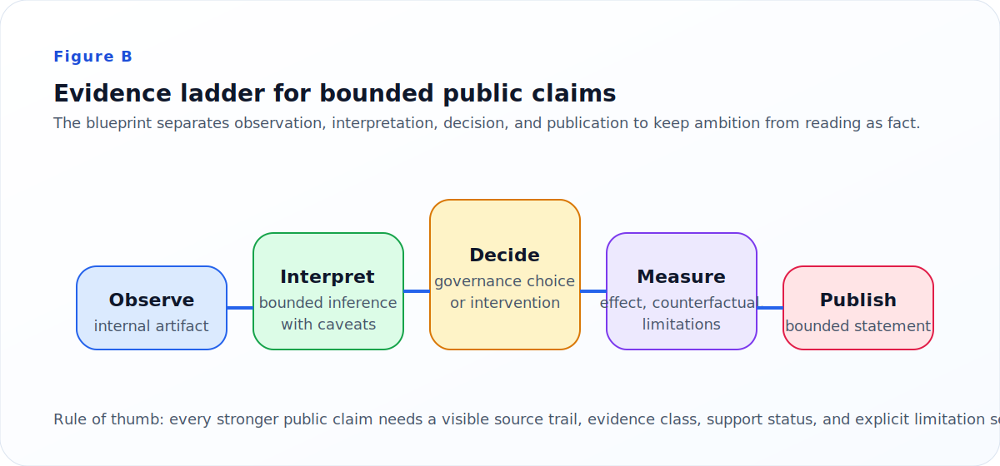

# Hermes Evolving Agents Roadmap

Local blueprint for a future public DE/EN release about the maturity of a learning-capable agent system.
This version is depersonalized, evidence-oriented, and now coherent enough for a conservative public release if desired.

## Abstract
This repository presents an **evidence-first blueprint** for reasoning about agent maturity under controlled risk rather than full autonomy. The core public claim is deliberately narrow: the current system posture is best read as a bounded, human-supervised learning setup with partial feedback closure, not as a proven self-improving autonomous system. The evaluation and governance framing in this repo is aligned with established work on AI risk management, human oversight, and multi-dimensional model/agent evaluation [1][2][3][4].

## Status
- **Current posture:** bounded public-release candidate, still unpublished
- **Current claim posture:** bounded, evidence-first, non-longitudinal
- **Best use right now:** review the narrative, inspect the evidence model, or publish the bounded blueprint with its current conservative framing

## Scientific basis and claim discipline
This blueprint distinguishes:
- **internal observation** from **external citation**
- **inference** from **design decision**
- **bounded evidence** from **broader aspiration**

The public methodology is informed by:
- NIST AI RMF and the NIST Generative AI Profile for governance, monitoring, and documentation [1][2]
- EU AI Act language for human oversight and bounded autonomy [3]
- HELM for multi-dimensional evaluation design [4]
- ReAct and agent benchmarks such as AgentBench, GAIA, and SWE-bench for agent loop and task-evaluation framing [5][6][7][8]

## Start with the right path

### For most readers
Use this if you want the shortest honest overview:
1. `docs/en/index.md` or `docs/de/index.md`
2. `docs/en/system-scope.md`
3. `docs/en/phases.md`
4. `docs/en/current-state.md`
5. `docs/en/methodology.md`
6. `docs/en/governance-and-guardrails.md`
7. `docs/en/proof-case-final-verdict.md` *(closing bounded evidence page)*

### For evidence reviewers
Use this if you want the bounded proof-case chain end to end:
1. `docs/en/trace-spine.md`
2. `docs/en/proof-case-scaffold.md`
3. `docs/en/proof-case-signal-recovery.md`
4. `docs/en/proof-case-outcome-recovery.md`
5. `docs/en/proof-case-intervention-selection.md`
6. `docs/en/proof-case-change-record.md`
7. `docs/en/proof-case-measurement-spec.md`
8. `docs/en/proof-case-final-verdict.md`

### For release preparation
Use this if you are deciding whether the blueprint is publishable:
- `docs/en/release-readiness-checklist.md`
- `docs/de/release-readiness-checklist.md`
- `docs/en/release-finish-task-order.md`
- `docs/en/final-manual-release-review.md`

## What can be stated today
- **bounded proof partially complete**
- **instrumentation-first reading**
- **counterfactual same-snapshot comparison**
- **not yet longitudinal**
- **publishable bounded blueprint, still intentionally conservative**

## Visual story and website structure
The companion website is now organized around a scientific/public-communication structure:
1. **Problem framing** — why bounded autonomy matters
2. **System model** — architecture and lifecycle diagrams
3. **Evidence posture** — what is observed, inferred, or still open
4. **Claims and limitations** — explicitly bounded conclusions
5. **References** — numbered, inspectable sources

### Core figures

*Figure A. Public-facing architecture of the bounded learning loop: signal → review → intervention → runtime → measurement inside a governance frame.*

*Figure B. Evidence ladder for keeping observation, interpretation, decision, measurement, and publication distinct in public communication.*

## What this repository contains

### Reader-facing narrative
Human-readable pages for scope, phases, current state, methodology, evidence posture, governance, and the bounded proof-case verdict.

### Machine-readable evidence model
Structured files for:
- claim-to-source mapping
- evidence registration
- phase gates
- trace-spine schema and example
- bounded proof-case artifacts
- release-readiness state

### Release-decision material
Documents and JSON artifacts that track readiness, remaining polish work, and the current publish-now verdict.

## Recommended figures and tables
The repo/website now emphasizes a compact set of explanatory artifacts:
- one **architecture diagram**
- one **feedback/lifecycle diagram**
- one **claim/evidence table**
- one **component table** (function, inputs, outputs, failure modes)
- one **limitations/non-goals table**

### Component matrix
| Component | Function | Main inputs | Main outputs | Main failure mode |
|---|---|---|---|---|
| Signal layer | Detect candidate improvement or risk signals | Telemetry, logs, human observations | Candidate issue or change request | Noise mistaken for a meaningful signal |
| Review layer | Challenge and prioritize candidate changes | Signals, historical context, human judgment | Explicit decision or rejection | Weak triage or unchallenged assumptions |
| Intervention layer | Apply a bounded change | Approved rule, patch, routing change, prompt or workflow update | Modified system condition | Change without reversibility or traceability |
| Runtime layer | Execute bounded agent behavior | Current system configuration and user tasks | Observable task behavior | Local success mistaken for general capability |
| Measurement layer | Estimate effect and caveats | Before/after traces, same-snapshot comparisons, reviewer notes | Bounded effect statement | Overclaiming from sparse or non-longitudinal evidence |

### Limitations and non-goals
| Area | Current posture |
|---|---|
| Longitudinal proof | Not yet established |
| Broad autonomous self-improvement | Not claimed |
| Public raw evidence completeness | Partial; strongest artifacts remain private |
| One-number maturity score | Intentionally avoided |
| Full external benchmark equivalence | Not yet demonstrated |

## Main unresolved questions
1. What exactly is the public object being classified: system, deployment, workflow, or loop?
2. What operational test supports the current phase assignment?
3. What is the canonical learning object from signal to measured effect?
4. What evidence would be public if the strongest raw evidence remains private?
5. What counts as one defensible closed-loop proof?

## Limits
- the strongest current proof is still **bounded**, not broad
- the current measurement is **same-snapshot**, not longitudinal
- parts of the strongest raw evidence remain private/internal
- presentation is now coherent enough for bounded public release, even if future polish remains possible
- stronger scientific claims would require a denser public evidence layer and more direct external citation across all key pages

## References
- `docs/en/references.md`
- `docs/de/referenzen.md`

## Repository map
- `docs/de/` — German narrative pages
- `docs/en/` — English narrative pages
- `data/` — claim/evidence/phase/proof-case JSON artifacts
- `site/` — local landing page and static presentation layer
- `docs/index.html` — GitHub Pages website entrypoint
- `assets/` — diagrams and figures

## Release readiness
Confirmatory go/no-go check is complete.
Current recommendation: this bounded blueprint is publishable now if you want to release it.

Related artifacts:
- `docs/en/release-finish-task-order.md`
- `docs/en/final-manual-release-review.md`
- `data/release-readiness-checklist.json`

## Current status
Currently maintained in a GitHub repository with public-release readiness as the target state. Visibility and GitHub Pages publication can be toggled conservatively at release time.

## References (inline citations)
[1] NIST AI RMF 1.0, 2023. https://doi.org/10.6028/NIST.AI.100-1  
[2] NIST Generative AI Profile, 2024. https://doi.org/10.6028/NIST.AI.600-1  
[3] EU AI Act, Regulation (EU) 2024/1689. https://eur-lex.europa.eu/eli/reg/2024/1689/oj  
[4] Liang et al., *Holistic Evaluation of Language Models*, TMLR 2023. https://openreview.net/forum?id=iO4LZibEqW  
[5] Yao et al., *ReAct*, ICLR 2023. https://openreview.net/forum?id=WE_vluYUL-X  
[6] Liu et al., *AgentBench*, 2023. https://arxiv.org/abs/2308.03688  
[7] Mialon et al., *GAIA*, 2023. https://arxiv.org/abs/2311.12983  
[8] Jimenez et al., *SWE-bench*, ICLR 2024. https://openreview.net/forum?id=VTF8yNQM66
